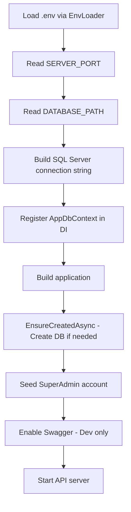

# SmartAxia Intern Manager API

Backend API for the SmartAxia Intern Manager application.

---

## Table of Contents

- [SmartAxia Intern Manager API](#smartaxia-intern-manager-api)
  - [Table of Contents](#table-of-contents)
  - [Tech Stack](#tech-stack)
  - [Prerequisites](#prerequisites)
    - [Required](#required)
    - [Optional](#optional)
    - [Verify Installation](#verify-installation)
  - [Getting Started](#getting-started)
    - [1. Configure Environment](#1-configure-environment)
    - [2. Install Dependencies \& Run](#2-install-dependencies--run)
    - [3. Access the API](#3-access-the-api)
  - [Environment Variables](#environment-variables)
    - [Variable Reference](#variable-reference)
  - [Project Structure](#project-structure)
  - [Startup Flow](#startup-flow)
  - [Database Schema](#database-schema)
    - [Users Table](#users-table)
    - [Enums](#enums)
    - [SuperAdmin Seeding](#superadmin-seeding)
  - [Authentication](#authentication)
    - [Endpoints](#endpoints)
    - [Token Details](#token-details)
    - [Cookie Configuration](#cookie-configuration)
    - [CSRF Protection](#csrf-protection)
  - [API Documentation](#api-documentation)

---

## Tech Stack

| Technology | Purpose |
|------------|---------|
| .NET 10 | ASP.NET Core Web API |
| Entity Framework Core 10 | ORM & database migrations |
| SQL Server Express | Database (default instance: `SQLEXPRESS`) |
| BCrypt.Net-Next | Password hashing |
| JWT Bearer | Authentication tokens |
| Swagger / OpenAPI | API documentation (Development only) |

---

## Prerequisites

### Required

- [.NET SDK 10](https://dotnet.microsoft.com/) (x64)
- [ASP.NET Core Runtime 10](https://dotnet.microsoft.com/) (x64)
- [SQL Server Express 2022](https://www.microsoft.com/sql-server/) (instance: `SQLEXPRESS`)

### Optional

- [SQL Server Management Studio (SSMS)](https://docs.microsoft.com/sql/ssms/) — for database inspection

### Verify Installation

```bash
dotnet --version
dotnet --list-runtimes
```

Ensure the Windows service **SQL Server (SQLEXPRESS)** is running.

> **Troubleshooting:** If you see "Framework version 10.0.0 missing", install the ASP.NET Core 10 x64 runtime.

---

## Getting Started

### 1. Configure Environment

Copy the example environment file and customize it:

```bash
cp .env.example .env
```

### 2. Install Dependencies & Run

```bash
dotnet restore
dotnet build InternManager.Api.csproj
dotnet run --project InternManager.Api.csproj
```

### 3. Access the API

| Endpoint | URL |
|----------|-----|
| API Base | `http://localhost:5184` |
| Swagger UI | `http://localhost:5184/swagger` |

> The port is configurable via `SERVER_PORT` in `.env`.

---

## Environment Variables

Create `api/.env` from `api/.env.example`:

```env
# Application
ASPNETCORE_ENVIRONMENT=Development
SERVER_PORT=5184

# JWT Configuration
JWT__KEY=dev_only_replace_me_with_32_plus_bytes_key_2026
JWT__ISSUER=SmartAxiaInternManager
JWT__AUDIENCE=SmartAxiaInternManagerClient
JWT__ACCESSTOKENMINUTES=15
JWT__REFRESHTOKENDAYS=7

# Database
DATABASE_PATH=app.db
SQLSERVER_INSTANCE=.\SQLEXPRESS

# SuperAdmin Seed
SUPERADMIN_EMAIL=admin@axia.com
SUPERADMIN_PASSWORD=Admin@1234
SUPERADMIN_FIRSTNAME=Super
SUPERADMIN_LASTNAME=Admin
```

### Variable Reference

| Variable | Required | Default | Description |
|----------|----------|---------|-------------|
| `SERVER_PORT` | No | `5184` | HTTP port for Kestrel server |
| `JWT__KEY` | **Yes** | — | Signing key (minimum 32 bytes) |
| `JWT__ISSUER` | Yes | — | JWT issuer claim |
| `JWT__AUDIENCE` | Yes | — | JWT audience claim |
| `DATABASE_PATH` | Yes | — | Used to name the SQL Server database |
| `SQLSERVER_INSTANCE` | No | `.\SQLEXPRESS` | SQL Server instance name |
| `SUPERADMIN_*` | Yes | — | Credentials for initial admin account |

> **Note:** `DATABASE_PATH=app.db` creates a database named `SmartAxiaInternManager_app`.

---

## Project Structure

```
api/
├── Common/                       # Shared app-wide building blocks
│   ├── Enums/                    # Shared enumerations
│   ├── Options/                  # Configuration option classes
│   └── Utilities/                # Common helpers and utilities
├── Controllers/                  # HTTP API endpoints
├── Data/                         # Database context and seeding
├── Extensions/                   # DI and pipeline registration extensions
├── Middleware/                   # Custom request/response middleware logic
├── Models/                       # Data models used by the API
│   ├── DTOs/                     # Request and response shapes
│   └── Entities/                 # EF Core entity classes
├── Properties/                   # Local run and debug settings
├── Services/                     # Business logic services
│    └── Auth/                    # Authentication services
├── .env                          # Local environment variables
├── .env.example                  # Environment template
├── appsettings.json
├── appsettings.Development.json
├── Program.cs                    # Application bootstrap
├── InternManager.Api.csproj
└── README.md
```

---

## Startup Flow



**Connection String Format:**
- Server: `.\SQLEXPRESS` (or `SQLSERVER_INSTANCE`)
- Database: `SmartAxiaInternManager_<DATABASE_PATH without extension>`

> **Note:** Database creation and seeding errors are logged but don't stop the server.

---

## Database Schema

### Users Table

Configured via Fluent API in `AppDbContext.OnModelCreating`:

| Column | Type | Constraints |
|--------|------|-------------|
| `Id` | `GUID` | Primary key, auto-generated (`NEWID`) |
| `FirstName` | `string` | Required, max 100 chars |
| `LastName` | `string` | Required, max 100 chars |
| `Email` | `string` | Required, max 255 chars, unique index |
| `PasswordHash` | `string` | Required (BCrypt) |
| `Role` | `enum` | Stored as string |
| `Status` | `enum` | Stored as string |
| `CreatedAt` | `DateTime` | UTC, auto-set |
| `UpdatedAt` | `DateTime` | UTC, auto-updated on save |

### Enums

**UserRole:** `SuperAdmin` | `Admin` | `Manager` | `Supervisor` | `Intern`

**UserStatus:** `Active` | `Archived`

### SuperAdmin Seeding

On startup, `DbSeeder` performs:

1. Check if a SuperAdmin user exists
2. If yes → log and skip
3. If no → read `SUPERADMIN_*` env vars, hash password with BCrypt, create user

---

## Authentication

### Endpoints

| Method | Route | Description |
|--------|-------|-------------|
| `POST` | `/auth/login` | Authenticate with email/password |
| `POST` | `/auth/refresh` | Rotate refresh token |
| `POST` | `/auth/logout` | Invalidate tokens and clear cookies |
| `GET` | `/auth/me` | Get current user claims (requires auth) |

### Token Details

| Token | Lifetime | Storage |
|-------|----------|---------|
| Access Token (JWT) | 15 minutes | `access_token` cookie |
| Refresh Token | 7 days | `refresh_token` cookie |
| CSRF Token | — | `csrf_token` cookie |

### Cookie Configuration

All cookies use:
- `Secure: true`
- `SameSite: Strict`
- `HttpOnly: true` (except `csrf_token`)

### CSRF Protection

- Global filter `CsrfValidationFilter` validates all `POST`, `PUT`, `PATCH`, `DELETE` requests
- Exempt: endpoints with `[AllowAnonymous]`
- Validation: `X-CSRF-Token` header must match the `csrf` claim in the JWT

---

## API Documentation

Swagger UI is available in Development mode at `/swagger`.

---
